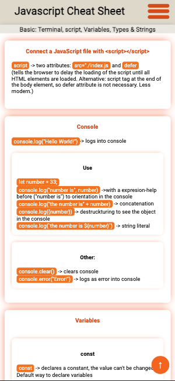
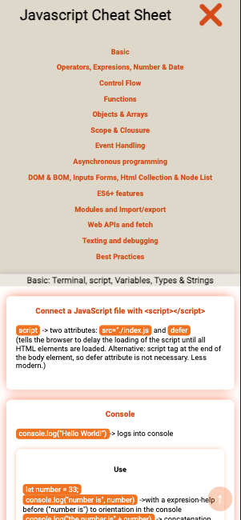
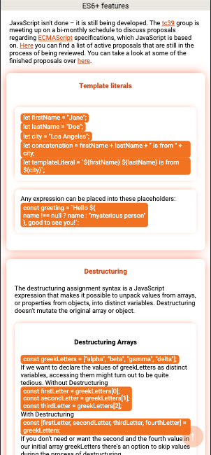
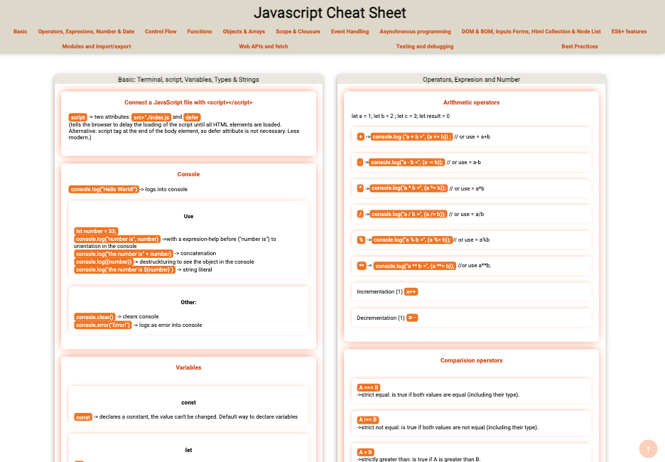
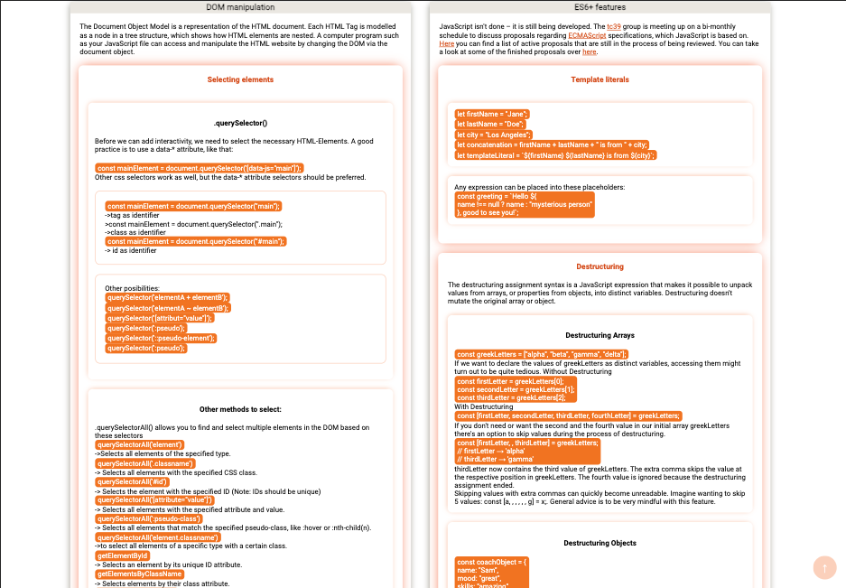

# Javascript Cheat Sheet (Mobile, Tablet & Desktop)

with "scroll to top button" & hamburger menu (mobile version)

# [Deployment](https://mariariosnavarro.github.io/jssheet/)

# Mobile

# Desktop & Tablet

